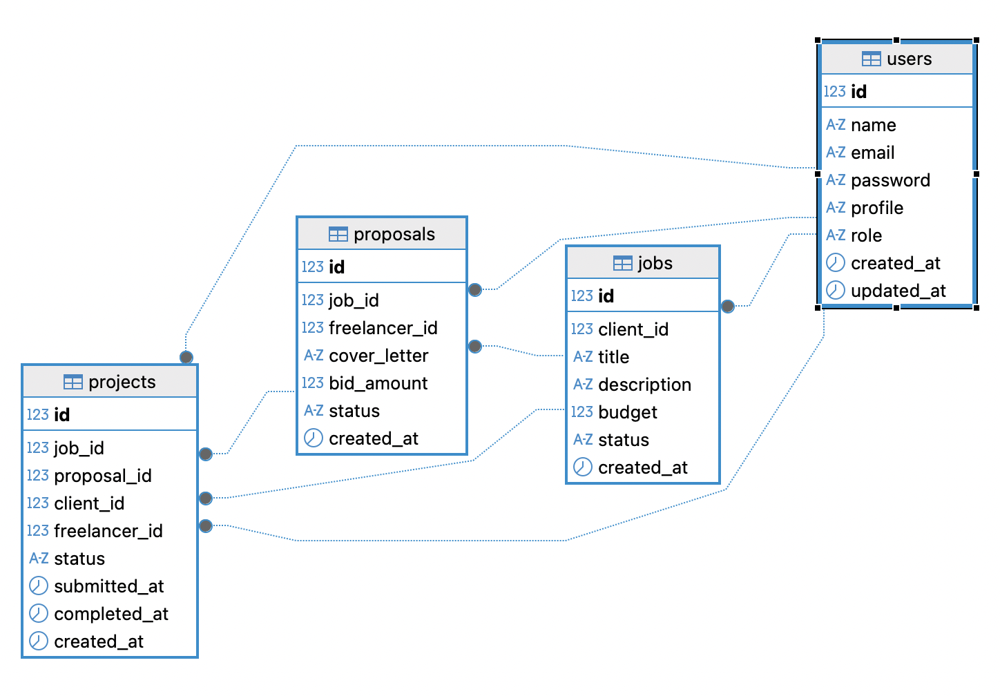

# Freelance Service Marketplace

This is an application where clients can offer jobs and freelancers can offer their services. When a client offers a job, the freelancer can submit a proposal detailing their skills and pricing. The client can then accept the proposal, and the freelancer can begin work.

## ERD

## Repository

[Github](https://github.com/nuninnih/service_marketplace)

## Deployment

[Railway](https://servicemarketplace-production-ddbb.up.railway.app)

## Documentation

[Postman](https://documenter.getpostman.com/view/22937108/2sBXwvJ8gf)
[JSON](./docs/service_marketplace.postman_collection.json)

## Slide

[Canva](https://canva.link/dro6upm0x30obxb)
